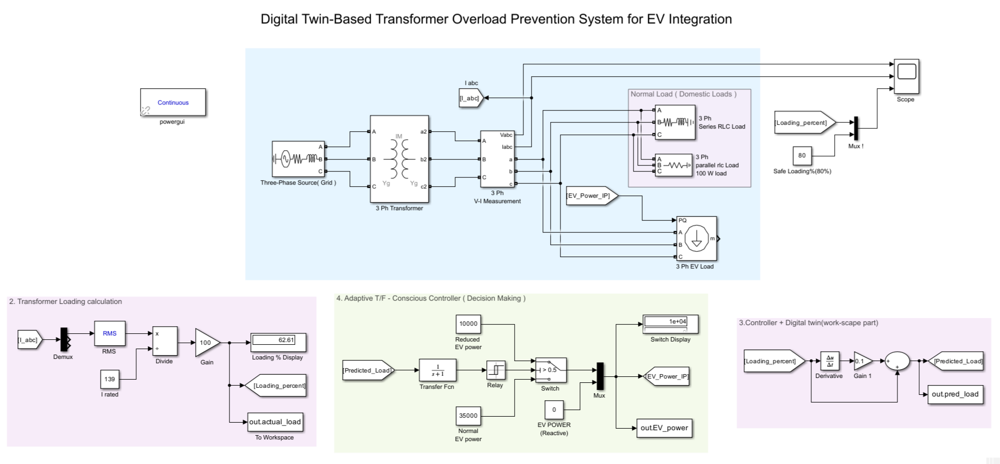
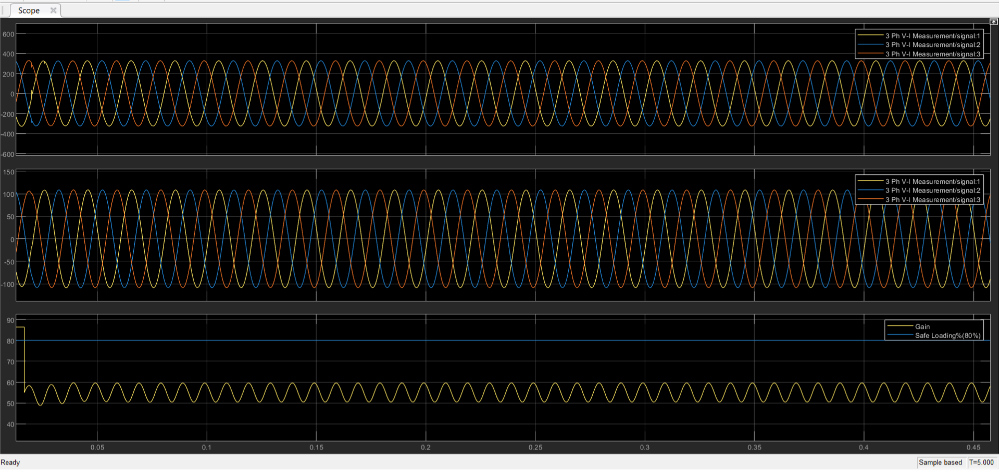
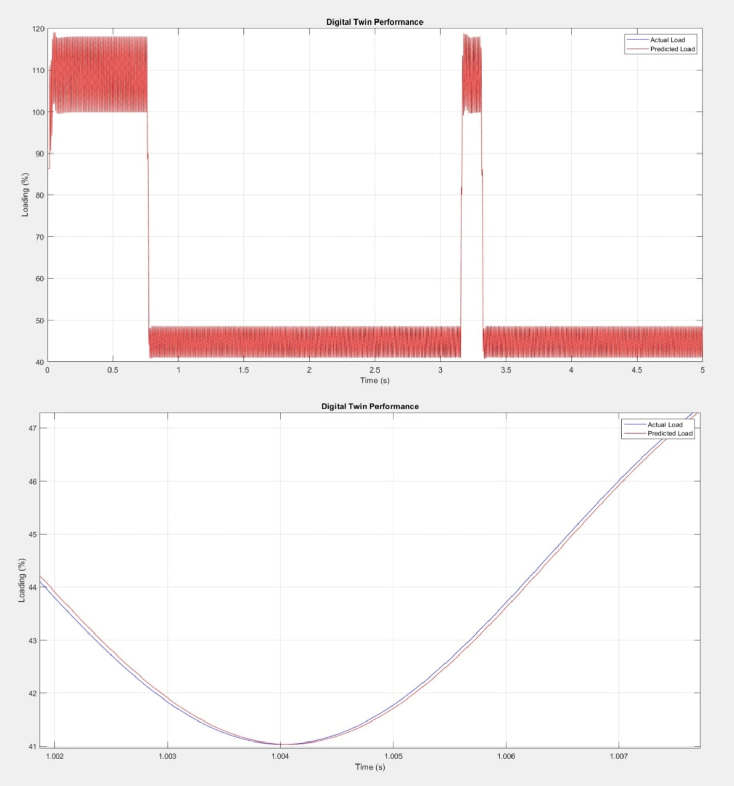

DIGITAL TWIN BASED ADAPTIVE EV CHARGING SYSTEM FOR TRANSFORMER OVERLOAD PREVENTION USING MATLAB/SIMULINK

A Digital Twin-based adaptive EV charging system that monitors transformer load in real time and dynamically controls charging to prevent overload using MATLAB/Simulink.

The **Digital Twin Based Adaptive EV Charging System for Transformer Overload Prevention** is an intelligent solution designed to optimize electric vehicle (EV) charging while ensuring the safe operation of distribution transformers. The system leverages digital twin technology to create a real-time virtual model of a physical transformer, enabling continuous monitoring and predictive analysis.

In this project, real-time parameters such as load demand, voltage, and current are monitored and fed into a simulation model developed in MATLAB/Simulink. The digital twin replicates the behavior of the transformer under varying load conditions and evaluates its performance dynamically.

Based on this analysis, the system implements an adaptive EV charging strategy that regulates charging power according to transformer loading conditions. When the transformer approaches critical limits, the charging rate is automatically adjusted to prevent overload, thereby enhancing system reliability and extending equipment lifespan.

Additionally, the system can incorporate basic machine learning techniques, such as regression-based prediction, to forecast load trends and improve decision-making accuracy. This enables proactive control rather than reactive responses.

Overall, the proposed system demonstrates a smart grid approach by integrating digital twin technology, adaptive control, and EV charging infrastructure, contributing to efficient energy management and sustainable transportation.

** Objectives **

1 Monitor transformer load in real time
2 Prevent transformer overload during EV charging
3 Implement adaptive charging control
4 Improve power system reliability

 ** Technologies Used **

1 MATLAB / Simulink
2 Digital Twin Modeling
3 Basic Machine Learning (Regression)
4 Power System Analysis

 MATLAB/Simulink Model

This is my developed MATLAB/Simulink model for the Digital Twin Based Adaptive EV Charging System. The model represents the complete system including:

- Three-phase grid and transformer setup  
- Voltage and current measurement blocks  
- Transformer loading calculation  
- EV charging load integration  
- Adaptive control mechanism  
- Digital twin-based prediction and decision system  

The model continuously monitors transformer loading conditions and dynamically adjusts EV charging power to prevent overload, ensuring safe and efficient operation of the power system.

** Working Principle **

The system creates a digital twin of the transformer using MATLAB/Simulink. Real-time load data is analyzed and compared with the simulated model. Based on transformer loading conditions, the EV charging rate is dynamically adjusted to prevent overload and ensure safe operation.

** Results **

1. Normal Loading Condition

This shows the transformer operating under safe loading conditions without any overload.

2. Overload Condition (Without Control)
.png)

In this scenario, the transformer experiences overload due to uncontrolled EV charging demand.

3. Overload Condition (With Adaptive Control)
.png)

The adaptive EV charging system reduces the charging load to prevent transformer overload.

4. Digital Twin Performance

This result demonstrates how the digital twin model effectively monitors and controls the system for safe operation.
1 Reduced transformer overload conditions
2 Improved charging efficiency
3 Better load management

This project presents a Digital Twin based adaptive EV charging system that monitors transformer load and dynamically controls charging to prevent overload, improving system reliability and efficiency.
